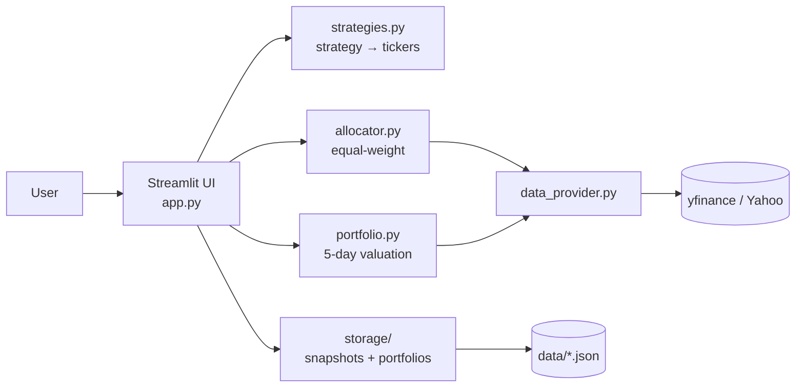

# Video Presentation — Slide Content (Part a)

**Total target: 5 minutes** — five slides, **roughly 1 minute of voice-over per
slide**. This is Part a of the 20-minute term-project video. Part b is the
15-minute walkthrough of the 10 test cases scripted in [DEMO_SCRIPT.md](DEMO_SCRIPT.md).

| Slide | Topic                | Time budget |
|-------|----------------------|-------------|
| 1     | Team Members         | 0:00 – 1:00 |
| 2     | Overall Architecture | 1:00 – 2:00 |
| 3     | Core Features        | 2:00 – 3:00 |
| 4     | Extra Features       | 3:00 – 4:00 |
| 5     | Challenges           | 4:00 – 5:00 |

---

## Slide 1 — Team Members  (0:00 – 1:00)

Title: **Stock Portfolio Suggestion Engine — Team**

| # | Name             | SJSU ID    | Role                                            |
|---|------------------|------------|-------------------------------------------------|
| 1 | Lam Nguyen       | 018229432  | Allocation Engine & Strategy Mapping            |
| 2 | Jahnavi Kedia    | 018282368  | Streamlit UI & Visualization                    |
| 3 | Nishan Paudel    | 018280561  | Market Data Integration & Portfolio Valuation   |
| 4 | Harishita Gupta  | 018323331  | Persistence, Testing & Documentation            |

Narration (~50 seconds):
> "Hi, we're the team behind the Stock Portfolio Suggestion Engine. Lam built
> the allocation engine and strategy mapping. Jahnavi built the Streamlit UI
> and the charts. Nishan built the market-data integration and the
> portfolio-valuation logic. And Harishita built the persistence layer, the
> test suite, and the documentation. Over the next four minutes we'll walk
> through the architecture, the core and extra features, and the main
> challenges we hit. Then we'll switch to a fifteen-minute live demo of all
> ten test cases."

---

## Slide 2 — Overall Architecture  (1:00 – 2:00)

Title: **System Architecture**

Narration (~55 seconds):
> "The architecture is a single Streamlit page on top of four pure-Python
> modules. Strategies, allocator, and portfolio valuation are deterministic —
> they take data in and return data out, which is what makes them
> unit-testable offline. The data-provider module is the only piece that
> touches the network — every yfinance call goes through it, and we wrap it
> at the call site with Streamlit caches: sixty seconds for live prices, one
> hour for history. Persistence is plain JSON on local disk — no database, no
> server, nothing to install. That's why setup on the grader's machine is
> just `pip install` and `streamlit run`."

---

## Slide 3 — Core Features  (2:00 – 3:00)

Title: **Core Features (mapped to spec)**

- Investment amount input with hard `$5,000` minimum (validated)
- Strategy multiselect — enforces 1 or 2 selections, capped at 6 deduped tickers
- Five strategies, each mapping to five tickers
- Equal-weight allocation with whole-share rounding and explicit residual cash
- Holdings table: Ticker, Strategy, Price, Shares, Cost, % of Portfolio
- Live portfolio value with one-click refresh (60-second cache)
- 5-day weekly trend chart with a horizontal initial-investment reference line
- Friendly error banners on invalid input or yfinance failure

Narration (~55 seconds):
> "These are the seven things the spec asked for, all visible in the
> dashboard. The user enters a dollar amount of at least five thousand,
> picks one or two strategies, and clicks build. We map each strategy to
> five tickers — that exceeds the spec's three-ticker minimum. We
> equal-weight-allocate the dollars, round to whole shares, and surface the
> residual cash explicitly so the totals reconcile. The holdings table shows
> the six required columns, the live value card shows the up-to-the-second
> portfolio value with a refresh button, and the weekly-trend chart shows
> the five-day history with a reference line at the initial investment.
> Validation errors render as red banners that block the build."

---

## Slide 4 — Extra Features  (3:00 – 4:00)

Title: **Extra Features**

- **S&P 500 benchmark overlay** — SPY normalized to start at the initial value
- **Sector diversification pie chart** — using `yfinance.Ticker.info`
- **CSV export** — single-click download of the holdings table
- **Save / load named portfolios** — JSON persistence in `data/portfolios.json`
- **Risk metrics card** — 5-day return, daily volatility, max drawdown
- **Strategy comparison mode** — side-by-side breakdown when 2 strategies picked

Narration (~55 seconds):
> "We added six extras on top of the spec. The SPY benchmark overlay lets the
> user compare their portfolio against the broader market on the same axis.
> The sector pie shows diversification across industries. CSV export gives
> the user something they can take into Excel. Save and load lets the grader
> verify persistence across a page refresh, which is one of the test cases.
> The risk-metrics card adds three numbers — five-day return, daily
> volatility, and max drawdown — that you'd expect on a real
> investment dashboard. And strategy comparison mode breaks the allocation
> apart by strategy when two are selected, so the user can see how each one
> contributed."

---

## Slide 5 — Challenges  (4:00 – 5:00)

Title: **Challenges & Lessons**

- **Interpreting "5 days history"** — persistence vs. backfill. We built both:
  snapshots are recorded each run, and missing days are backfilled from
  yfinance close prices. The chart visually distinguishes the two sources.
- **yfinance flakiness and rate limits** — Yahoo's API is occasionally
  unstable. Streamlit's `@st.cache_data` decorators (60-second TTL for live
  prices, 1-hour for history) keep request volume modest and the UI smooth.
- **Equal-weight rounding residuals** — whole-share allocation always leaves
  cash on the table. We surface the residual in a dedicated metric card so
  Total Invested + Residual Cash always reconciles to the input amount.

Narration (~55 seconds):
> "Three challenges shaped the design. First, the spec said keep five days of
> history but didn't specify how — so we built persistence and backfill
> together. Snapshots get written on every run, and any missing days get
> filled in from yfinance historical close prices. The chart shows the two
> sources differently. Second, yfinance is occasionally rate-limited or just
> flaky, so we wrapped every call in a Streamlit cache with an explicit TTL
> — sixty seconds for live prices, an hour for the historical pull. Third,
> equal-weight allocation with whole shares always leaves cash on the table.
> Rather than hide that, we made residual cash a first-class metric. With
> those out of the way, let's switch to the live demo of the ten test cases."

---

## Optional appendix slide — Test Plan (only if time allows)

- 10 manual test cases in [TEST_CASES.md](TEST_CASES.md) cover validation,
  single and combined strategies, refresh, charting, CSV export, and persistence.
- 30 offline `pytest` tests cover strategies, allocator math, portfolio
  valuation, risk metrics, and storage round-trips.
