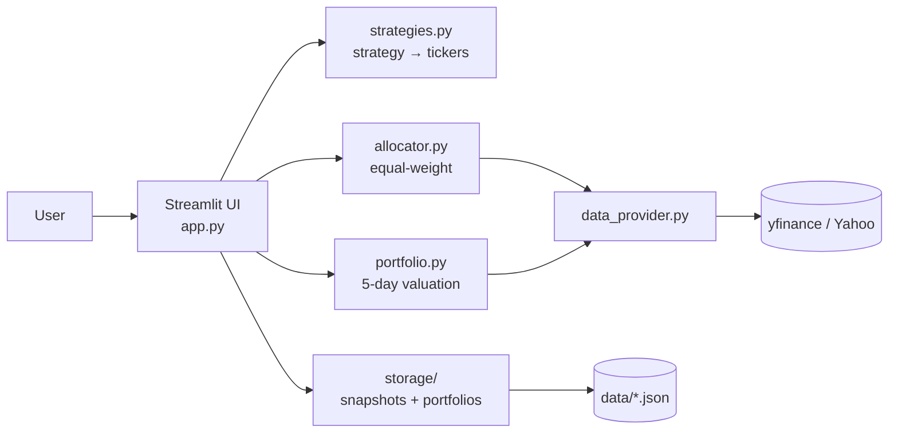

# Video Presentation — Slide Content

Five slides total. Roughly 2 minutes of voice-over per slide.

---

## Slide 1 — Team Members

Title: **Stock Portfolio Suggestion Engine — Team**

| # | Name             | SJSU ID    | Role                                            |
|---|------------------|------------|-------------------------------------------------|
| 1 | Lam Nguyen       | 018229432  | Allocation Engine & Strategy Mapping            |
| 2 | Jahnavi Kedia    | 018282368  | Streamlit UI & Visualization                    |
| 3 | Nishan Paudel    | 018280561  | Market Data Integration & Portfolio Valuation   |
| 4 | Harishita Gupta  | 018323331  | Persistence, Testing & Documentation            |

Narration:
> "Hi, we're the team behind the Stock Portfolio Suggestion Engine. Lam owns
> the allocation engine and strategy mapping; Jahnavi owns the Streamlit UI
> and the visualizations; Nishan owns the market-data integration and the
> portfolio-valuation logic; and Harishita owns the persistence layer, the
> test suite, and the documentation. We'll now walk you through the design
> and a live demo of all 10 test cases."

---

## Slide 2 — Overall Architecture

Title: **System Architecture**

Narration bullets:
- A single Streamlit page is the only UI surface; everything else is a pure
  Python module behind it.
- Strategy mapping, allocation, and valuation are pure functions — they take
  data in and return data out, which makes them trivially unit-testable.
- The data provider is the only module that touches the network. Streamlit's
  cache decorators wrap it at the call site so we keep the request volume low.
- Persistence is plain JSON files on disk. No database, no server.

---

## Slide 3 — Core Features

Title: **Core Features (mapped to spec)**

- Investment amount input with hard `$5,000` minimum (validated)
- Strategy multiselect; enforces 1 or 2 selections, max 6 deduped tickers
- Five strategies, each mapping to five tickers
- Strategy descriptions in an expandable sidebar block
- Equal-weight allocation with whole-share rounding and residual-cash tracking
- Holdings table: Ticker, Strategy, Price, Shares, Cost, % of Portfolio
- Current portfolio value with one-click refresh and a 60-second live cache
- Weekly trend — 5-day portfolio value line chart with a horizontal reference
  line at the initial investment
- Friendly error toasts on invalid input and on yfinance failure

---

## Slide 4 — Extra Features

Title: **Extra Features**

- **S&P 500 benchmark overlay** — SPY normalized to start at the initial
  investment so the user can compare their portfolio to the market on the
  same axis.
- **Sector diversification pie chart** — sector data from `yfinance.Ticker.info`,
  with unknowns gracefully labeled "Other".
- **CSV export** — single-click download of the holdings table for offline
  analysis or sharing.
- **Save / load named portfolios** — JSON-backed persistence so the grader can
  rebuild a saved portfolio after a page refresh.
- **Risk metrics card** — 5-day return, daily volatility, max drawdown.
- **Strategy comparison mode** — when two strategies are selected, a
  side-by-side breakdown shows how each strategy contributed to the portfolio.

---

## Slide 5 — Challenges

Title: **Challenges & Lessons**

- **Interpreting "5 days history"** — the spec implied persistence, so we
  built two mechanisms: snapshots that we record on every run, and a
  historical backfill that fills any gaps using yfinance close prices. The
  chart blends both, distinguishing them visually.
- **yfinance rate limits and flakiness** — wrapping calls in
  `@st.cache_data` with explicit TTLs (60s for live, 1 hour for history)
  kept the request volume manageable and the UI responsive.
- **Equal-weight rounding residuals** — whole-share allocation always leaves
  residual cash. We surface that residual explicitly in a metric card so the
  totals reconcile to the input amount.

---

## Optional appendix slide — Test Plan

- 10 numbered, manual test cases in `TEST_CASES.md` cover validation, single
  and combined strategies, refresh, charting, CSV export, and persistence.
- An offline `pytest` suite covers strategy mapping, allocation math,
  portfolio valuation, and storage round-trips.
